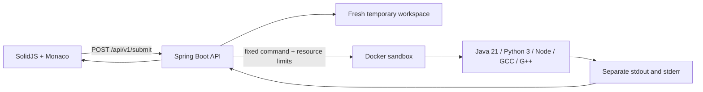

# CodeArena

CodeArena is a SolidJS coding workspace with Monaco Editor and a Spring Boot API for isolated execution of Java, Python 3, JavaScript, C++, and C.

## Architecture



The frontend remains at the repository root. The new `backend/` directory contains the API and the sandbox image recipe. Compiler and runtime commands are selected on the server from an allowlist; command strings from the browser are never executed.

## Requirements

- Node.js 18 or newer and npm
- Java 21 and Maven 3.6.3 or newer for the API
- Docker Engine for the execution worker

## Run locally

1. Build the sandbox image from the repository root:

   ```sh
   docker build -t codearena/sandbox:latest backend/sandbox
   ```

2. Start the API on a machine with Docker Engine and the `docker` CLI available to the API process:

   ```sh
   cd backend
   mvn spring-boot:run
   ```

   The API listens on `http://localhost:8080` by default.

3. Configure the frontend API base URL. Copy `.env.example` to `.env.local` and use:

   ```dotenv
   VITE_API_URL=http://localhost:8080/api/v1
   ```

   `VITE_API_URL` is the API base path; the frontend adds `/submit` itself.

4. From the repository root, install dependencies and start Vite:

   ```sh
   npm ci
   npm run dev
   ```

## API

### `GET /api/v1/health`

Returns API and execution-worker availability. The worker is `UP` only when Docker and the configured sandbox image are available.

### `POST /api/v1/submit`

Request:

```json
{
  "sourceCode": "public class Main { public static void main(String[] args) { System.out.println(\"hello\"); } }",
  "language": "java",
  "stdin": ""
}
```

Response fields include `executionId`, `status`, actual program `stdout` and `stderr`, `compileError`, `exitCode`, `executionTime` (milliseconds), and `outputTruncated`. `memoryUsage` is null because this worker does not currently measure per-process memory. An empty stdout is preserved as an empty string.

The API accepts these language names and runs fixed server-side commands:

| Language | Source file | Compile | Run |
| --- | --- | --- | --- |
| Java | `Main.java` | `javac Main.java` | `java Main` |
| Python 3 | `main.py` | — | `python3 main.py` |
| JavaScript | `main.js` | — | `node main.js` |
| C++ | `main.cpp` | `g++ -std=c++17 main.cpp -o program` | `./program` |
| C | `main.c` | `gcc -std=c17 main.c -o program` | `./program` |

## Sandbox controls

Each execution gets a UUID-named temporary directory and fresh named container. Docker runs with no network, a read-only root filesystem, a non-root UID, dropped Linux capabilities, `no-new-privileges`, one CPU, 256 MB memory, a 64-process limit, bounded file descriptors/output, and a five-second runtime timeout by default. Standard input is written, flushed, and closed; stdout and stderr are drained concurrently. The container and workspace are removed after completion or timeout.

The backend must run on a host whose Docker daemon can access the configured execution workspace path. The Docker socket is not mounted in the sandbox container. Do not expose the public execution endpoint to untrusted traffic without adding authentication and rate limits appropriate to the deployment.

## Configuration

Frontend: `.env.example` contains `VITE_API_URL`.

Backend: see `backend/.env.example`. Runtime settings can be supplied as environment variables, including `CODEARENA_SANDBOX_IMAGE`, `EXECUTION_TEMP_ROOT`, `EXECUTION_TIMEOUT_SECONDS`, `COMPILE_TIMEOUT_SECONDS`, `MAX_SOURCE_BYTES`, `MAX_STDIN_BYTES`, `MAX_OUTPUT_BYTES`, `MAX_PARALLEL_EXECUTIONS`, and `CORS_ALLOWED_ORIGINS`.

No database credentials or service keys are required by the execution API.

## Tests

Docker integration tests are in `backend/src/test/java/com/codearena/execution/DockerExecutionIntegrationTest.java`. Build the sandbox image first, then run:

```sh
cd backend
mvn test
```

Tests skip if Docker or the sandbox image is unavailable. They cover all five runtimes, actual stdout, stdin/EOF, empty output, stderr separation, compilation errors, runtime errors, timeout, and memory limits.

## Current scope

Implemented: the browser editor-to-API execution path, Docker-backed isolated execution, health endpoint, structured errors, and Docker integration tests.

Not implemented yet: accounts/JWT, roles, PostgreSQL/Supabase persistence and migrations, problem/test-case judging, Redis/RabbitMQ queuing, WebSocket status updates, per-process memory measurement, and an assessment/contest backend. The execution endpoint is synchronous and uses a bounded in-process concurrency semaphore; it is not a distributed worker queue.

For production, deploy the API on a dedicated Docker-capable worker host, set `CORS_ALLOWED_ORIGINS` to the exact frontend origin, and add authentication, per-user quotas, persistent job handling, and operational monitoring before public launch.

## Community

To report harassment, discrimination, or other unacceptable behavior, see the [CodeArena Reporting Guidelines](CODE_OF_CONDUCT.md).
